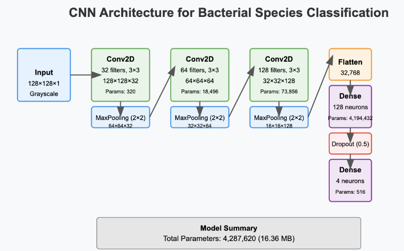
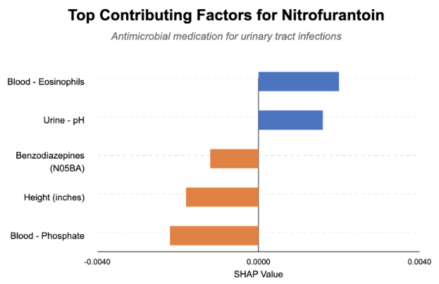
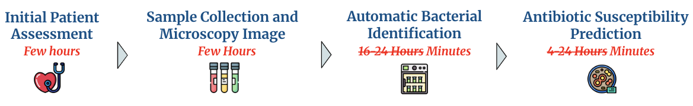

  

# antibiotic stewardship

When patients present with symptoms of a bacterial infection, doctors face a critical dilemma. Traditional culture-based antibiotic susceptibility testing (AST) takes 24-48 hours to determine effective antibiotics. This delay forces physicians to either prescribe broad-spectrum antibiotics—contributing to antimicrobial resistance (AMR)—or risk using narrow, potentially ineffective antibiotics, endangering patients.

The consequences are severe. The CDC estimates over 35,000 Americans die annually due to AMR, with costs reaching $55 billion. Globally, according to the WHO, bacterial AMR directly caused approximately 1.3 million deaths and contributed to 5 million deaths in 2019.

Broad-spectrum antibiotics create wider disruption of beneficial microbiota, allowing resistant bacteria to thrive without competition, and increase selective pressure for resistant genes. Effective antibiotic stewardship programs rely on timely, accurate information about bacterial pathogens and their susceptibility patterns. Due to the current 24-48 hour delay, physicians often resort to empirical broad-spectrum therapy as a safety measure, undermining stewardship efforts.

**resist.ai supports antibiotic stewardship by using AI to accelerate bacterial identification and antibiotic susceptibility testing, potentially saving up to 48 hours in treatment decisions. By providing rapid, personalized antibiotic recommendations, our system supports antibiotic stewardship, reducing inappropriate antibiotic use while improving patient care.**

# demo

<video width="640" height="360" controls>
  <source src="images/resistai_demo.webm" type="video/webm">
</video>
 

# behind the product

resist.ai uses two distinct modeling pipelines to deliver a comprehensive set of personalized antibiotic recommendations. The first pipeline uses computer vision and phase contrast microscopy image data to identify the bacteria causing an infection. The second uses the identified bacteria and Electronic Health Record (EHR) data to predict antibiotic susceptibilities. 

**1. Identify bacteria**
  - Requires minimal equipment: just a phase contrast microscope and a single photograph captured by a lab technician
  - Developed custom convolutional neural network for bacterial identification, trained model on [Phase-Contrast Time Lapse Data](https://zenodo.org/records/10069635) for three different bacterial species: Escherichia Coli, Klebsiella Pneumoniae, and Psuedomonas Aeruginosa
  - Simpler deep learning architectures outperformed complex, large models

**2. Predict antibiotic susceptibilities**
  - Transformed complex EHR data from the [MIMIC IV Database](https://mimic.mit.edu/) into meaningful features while preventing data leakage
    - Key techniques included higher-level racial groupings, mean imputation by gender & age, CCSR category mapping, ATC category mapping, and bag-of-words counts
    - Tracked total medical procedures and days since last medical procedure
  - Evaluated logistic regression, Random Forest, XGBoost, and Histogram-Based XGBoost
  - Histogram-Based XGBoost selected as it effectively handles missing values common in EHR data
  - Built individual models for each bacteria-antibiotic pair
  - Prioritized precision over recall as prescribing a resistant antibiotic (false positive) is more dangerous than missing a susceptible one (false negative)

**3. Explain**
- Used SHAP values to transform ML-based antibiogram from a "black box" into an interpretable clinical tool
- Identified key patient-specific features (lab values, medication history, clinical timeline) that influence antibiotic resistance probabilities
- Explainable predictions enable clinicians to understand not just what the model predicts, but why

**4. Evaluate**
- **Technical performance**
  - Microscopy model: 97% overall accuracy, with precision ranging from 0.89 to 1.00 and recall from 0.96 to 0.98
  - EHR-based antibiotic susceptibility models: precision between 0.55 and 0.96, comparable to research results (0.46-0.99)
    
- **Fairness assessment**
  - Tested E. coli + Ampicillin across racial groups
  - No statistically significant difference in overall accuracies (chi-squared: 12.6, p-value: 0.39)
  - Identified disparities in specific error types (i.e., false-positive rates)
  - Reduced disparities significantly through stratification on combined racial category and target, eliminating statistical significance in differences for 3 groups and lowering false positive rates for Hispanic groups from 45% to 24%
  
- **Decision comparison** 
  - *Resistance assessment*
    - 19% of antibiotics prescribed by physicians were resistant
    -  Models would have correctly identified 59% of these antibiotics as resistant
  - *Lower tier usage*
    - 56% of patients received a lower tier where a higher tier was available 
    - Models would have identified a first-tier, susceptible antibiotic for 99% of these patients 
  - *Broad spectrum usage*
    - 85% of patients received a broad spectrum where a lower spectrum was available 
    - Models would have identified a lower spectrum, susceptible antibiotic for 99% of these patients

**5. Learn**
- Simpler ML models often out-perform complex ones 
- Balance precision and recall based on clinical context 
- Stratification is necessary to reduce disparities and improve equity 
- Data leakage is a complex and nuanced issue in EHR data
- Explainability is critical for clinical adoption
- AI has the potential to significantly improve antibiotic stewardship 

# so what?  

resist.ai serves as a **reliable antibiotic prescription assistant** that:
- Requires **minimal equipment**
- Provides **personalized** information to inform antibiotic prescribing 
- Recommends top first-line, narrow-spectrum, susceptible antibiotics to **slow the rate of AMR**
- Delivers **comprehensive explanations** of why specific antibiotics are selected for each patient
- And, ultimately **saves physicians up to 48 hours** by automatically identifying infectious bacteria and predicting antibiotic susceptibilities

By improving antibiotic recommendations and delivering results much faster than current culture tests, resist.ai could **significantly reduce the use of broad-spectrum antibiotics, combat antimicrobial resistance, and improve patient outcomes**. Additionally, the data collected could support ongoing antibiotic resistance research.

# meet the team 

**Rini Gupta** - *Project Lead & ML Engineer* - [LinkedIn](https://www.linkedin.com/in/rini-m-gupta/)

**Jas Dinh** - *Front-End Developer & ML Engineer* - [LinkedIn](https://www.linkedin.com/in/jas-dinh/)

**Katt Painter** - *Product Manager & Data Engineer* - [LinkedIn](https://www.linkedin.com/in/kathryn-painter/)

**Brian Xiao** - *Product Manager & Data Scientist* - [LinkedIn](https://www.linkedin.com/in/brian-xiao-379b1764/)
